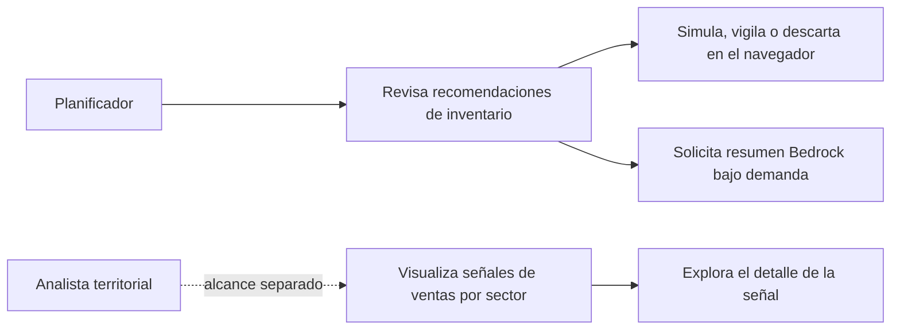

# Casos de uso — FarmaSeñal

**Estado:** el flujo de propuesta de CU-02 y la revisión/decisión local de CU-06 están implementados en la app local con datos sintéticos. CU-01, CU-03, CU-04 y CU-05 conservan alcance especificado/propuesto; su presencia aquí no significa que estén implementados por completo.

## Propósito y alcance

El flujo operativo implementado permite al planificador revisar propuestas de traslado entre sucursales y casos para vigilancia según inventario, caducidad, ventas agregadas y proximidad. Puede registrar una decisión como simulación, vigilancia o descarte en el navegador y solicitar un resumen a Amazon Bedrock. Como flujo separado, un analista podría revisar cambios de ventas por sector junto con otras fuentes. Todo el flujo de demo usa datos sintéticos.

Este documento toma como alcance de referencia el [plan de implementación del backend](../backend/PLAN_IMPLEMENTACION_BACKEND.md). El equipo confirmó que la línea asignada a Los 21 Pilotos es **mejora operativa para Farmaenlace**; las fuentes oficiales revisadas no indican el equipo asignado a cada línea. El flujo operativo actual sigue el alcance de [SOLUCION.md](SOLUCION.md), con recomendaciones explicables y simuladas.

Las señales representan cambios observados o estimados en ventas agregadas; pueden sugerir dónde revisar una posible tendencia de salud, pero no identifican una enfermedad ni estiman casos confirmados. La propuesta de mostrar posibles tendencias de salud amplía el plan backend actual, que define alertas de demanda y proyecciones de unidades por categoría, no un modelo epidemiológico. Para asociar señales a enfermedades concretas harían falta categorías justificadas y validadas por especialistas, datos de referencia y evaluación del modelo. Una variación también puede deberse a promociones, precios, disponibilidad u otros cambios operativos. No se usan datos de clientes ni transacciones individuales. La simulación no crea órdenes reales ni modifica el inventario; tampoco se presupone conexión con SAP ni acceso a datos reales de Farmaenlace.

## Actores

| Actor | Participación |
|---|---|
| **Analista de salud pública o vigilancia territorial** | Usuario propuesto para revisar las señales por sector con otras fuentes y decidir si ameritan investigación. Su participación debe confirmarse como parte del alcance del producto. |
| **Planificador de abastecimiento** | Usuario del flujo operativo. Revisa proyecciones de demanda y evalúa una acción entre sucursales. |
| **Fuente de datos sintéticos** | Proporciona los cuatro CSV de farmacias, productos, ventas e inventario. Se leen localmente durante el desarrollo o pueden incluirse en Lambda; S3 privado es una opción futura. |
| **Proveedor de rutas** | Evolución futura opcional para estimar tiempos y distancias por carretera; no participa en la recomendación implementada. |

El cliente y las sucursales son beneficiarios indirectos de una mejor disponibilidad; no interactúan con el prototipo descrito aquí.

## Resumen del flujo principal



## CU-01 — Consultar proyección de demanda

| Campo | Descripción |
|---|---|
| **Actor principal** | Planificador de abastecimiento. |
| **Objetivo** | Revisar las unidades de demanda proyectadas para una categoría y un sector. |
| **Disparador** | El planificador abre la proyección desde el dashboard o una alerta. |
| **Precondiciones** | El sector y categoría seleccionados tienen datos históricos suficientes para la regla de proyección. |

### Flujo principal

1. El planificador elige sector, categoría y horizonte disponible.
2. El sistema calcula la proyección de unidades para el horizonte solicitado (siete días por defecto en la propuesta del backend).
3. El sistema presenta el resultado junto con el horizonte, el estado de suficiencia del historial y la etiqueta de datos sintéticos.
4. El planificador compara la proyección con el inventario disponible y, si corresponde, continúa a CU-02.

### Alternativas y errores

- **Historial insuficiente o incompleto:** se muestra `insufficient_data` y la razón; no se inventa una precisión o probabilidad.
- **Hubo quiebres de stock en el historial:** el sistema señala que las ventas observadas pueden subestimar la demanda si no cuenta con información para corregirlas.

**Postcondición:** queda visible una proyección de unidades de productos. No es una predicción de incidencia de enfermedad.

## CU-02 — Simular un traslado entre sucursales

| Campo | Descripción |
|---|---|
| **Actor principal** | Planificador de abastecimiento. |
| **Actores de apoyo** | Ninguno en el flujo actual; un proveedor de rutas queda como evolución futura. |
| **Objetivo** | Evaluar si una sucursal con excedente puede cubrir parte del faltante actual de inventario de otra sucursal. |
| **Disparador** | El planificador revisa las propuestas de la pestaña Recomendaciones. |
| **Precondiciones** | Existe un escenario sintético con stock, mínimos, caducidad y sucursales identificadas. |

### Flujo principal

1. El sistema detecta destinos en estado agotado, crítico o bajo cuyo stock está por debajo del mínimo registrado.
2. Busca sucursales origen con excedente del mismo producto, reserva mínima, caducidad futura conocida y coordenadas válidas.
3. Ordena los orígenes por distancia geográfica aproximada en línea recta y descuenta temporalmente cantidades ya propuestas en la misma evaluación.
4. El sistema devuelve producto, cantidad hasta el faltante del mínimo, origen, destino, cobertura y evidencias; si la cobertura es parcial o no hay origen elegible, añade un caso de vigilancia.
5. El planificador revisa la propuesta. No hay ruta vial, tiempo de viaje ni efecto económico calculado en este flujo.

### Alternativas y errores

- **Ningún origen tiene excedente seguro:** se informa que no hay traslado recomendado.
- **Faltan datos de inventario, coordenadas o caducidad:** se explica qué criterio no pudo evaluarse y se limita la recomendación. Si una fecha tiene formato inválido, la API rechaza el dataset.
- **Coordenadas, caducidad o excedente insuficientes:** no se ofrece ese origen y se explica la limitación en el caso de vigilancia.

**Postcondición:** se presenta una recomendación simulada. No se crea una orden, no se reserva producto y no se modifica el inventario.

## CU-06 — Revisar recomendaciones y tomar una decisión local

| Campo | Descripción |
|---|---|
| **Actor principal** | Planificador de abastecimiento. |
| **Objetivo** | Priorizar sucursales para reabastecimiento simulado o vigilancia usando propuestas trazables. |
| **Disparador** | El planificador abre la pestaña **Recomendaciones**. |
| **Precondiciones** | Los cuatro CSV sintéticos son legibles por la API. El resumen Bedrock requiere además un modelo/región/rol configurados. |

### Flujo principal

1. La vista solicita las recomendaciones calculadas sobre el dataset completo, sin heredar los filtros activos del mapa.
2. Presenta conteos de traslados simulables, vigilancia, decisiones locales y unidades aún sin cubrir.
3. El planificador revisa producto, origen/destino, cantidad, estado/cobertura, caducidad, distancia aproximada y evidencia de ventas coincidentes.
4. El planificador elige **Simular traslado**, **Poner en vigilancia** o **Descartar**. La decisión se guarda únicamente en `localStorage` del navegador actual y puede limpiarse.
5. Si desea explicación, pulsa **Analizar con AWS AI**. Bedrock resume las propuestas ya calculadas; si AWS no está disponible, se mantiene el resultado por reglas con etiqueta de modo local/simulado.

### Alternativas y errores

- **Faltan CSV o tienen valores inválidos:** la vista informa el error y permite reintentar.
- **No hay propuestas:** se muestra un estado vacío explicable.
- **Bedrock no está configurado o falla:** las recomendaciones permanecen disponibles y la respuesta identifica el proveedor `fallback`.
- **El usuario cambia de dispositivo o limpia el almacenamiento:** las decisiones locales dejan de estar disponibles; no se sincronizan con otros usuarios.

**Postcondición:** queda una decisión de demo vinculada a la recomendación en el navegador actual. No se cambia inventario ni se genera una orden real.

## CU-03 — Comparar estrategias e impacto estimado

| Campo | Descripción |
|---|---|
| **Actor principal** | Planificador de abastecimiento. |
| **Objetivo** | Comparar el escenario Geo-AI con una estrategia base usando la misma demanda e inventario inicial. |
| **Disparador** | El planificador solicita ver el resultado de una simulación. |
| **Precondiciones** | Hay datos sintéticos y supuestos definidos para demanda, inventario, margen y costo de traslado. |

### Flujo principal

1. El sistema calcula el resultado de la estrategia base, por ejemplo, sin traslado o con una regla sencilla.
2. Calcula el resultado de la estrategia Geo-AI con las señales y traslados simulados.
3. Presenta, para ambos escenarios, demanda no atendida, unidades con riesgo de caducidad y costo estimado de traslados.
4. Presenta el costo operativo estimado y su diferencia frente a la base.
5. El planificador revisa los supuestos junto con el resultado.

La métrica propuesta es:

```text
Costo estimado = (unidades de demanda no atendida × margen unitario estimado)
               + (unidades caducadas × costo unitario estimado)
               + costo estimado de los traslados

Reducción (%) = 100 × (Costo_base − Costo_Geo-AI) / Costo_base
```

Si el costo base es cero, se informa la diferencia absoluta en vez del porcentaje.

### Alternativas y errores

- **Faltan márgenes, costos u otros supuestos:** el sistema muestra los indicadores disponibles y señala qué valores son supuestos sintéticos.
- **No existe estrategia base comparable:** no se calcula una reducción; se informa la diferencia que sí pueda estimarse.
- **La demanda real no está disponible:** los resultados se describen como simulación, nunca como ahorro o impacto medido en Farmaenlace.

**Postcondición:** se muestra una comparación reproducible sobre el mismo escenario de entrada, con sus supuestos visibles.

## CU-04 — Explorar el detalle de una señal de demanda

| Campo | Descripción |
|---|---|
| **Actor principal** | Analista de salud pública o vigilancia territorial (propuesto). |
| **Objetivo** | Entender qué ventas agregadas originaron una señal y qué limitaciones afectan su interpretación. |
| **Disparador** | El analista selecciona un sector o una señal en el mapa de CU-05. |
| **Precondiciones** | CU-05 identificó una variación para el sector y periodo seleccionados. |

### Flujo principal

1. El analista abre una señal del mapa.
2. El sistema presenta el sector, periodo, categoría, unidades observadas y referencia esperada, desviación, severidad y estado sintético de los datos.
3. El sistema explica qué historial y campos se usaron y si existe una etiqueta descriptiva validada para la categoría.
4. El analista revisa la señal como una pista para investigar con otras fuentes. El planificador puede consultar la proyección en CU-01 o evaluar un traslado simulado en CU-02.

### Alternativas y errores

- **No se detectan desviaciones relevantes:** se muestra el estado sin alertas para los filtros seleccionados.
- **Historial insuficiente:** se explica la limitación y no se presenta una alerta con falsa precisión.
- **Hay semanas con quiebre de stock conocido:** si existe el dato `stockoutDays`, el sistema lo considera como limitación de las ventas observadas; si no existe, muestra esa limitación.

**Postcondición:** el analista comprende la base y las limitaciones de la señal. La alerta no identifica una enfermedad ni afirma por qué aumentaron las ventas.

## CU-05 — Visualizar señales tempranas de posibles enfermedades por sector

| Campo | Descripción |
|---|---|
| **Actor principal** | Analista de salud pública o vigilancia territorial (propuesto). |
| **Objetivo** | Identificar sectores donde las ventas de categorías asociadas a síntomas presentan una variación que podría servir como señal temprana de una posible tendencia de enfermedad, para que un profesional la revise. |
| **Disparador** | El analista abre el mapa de señales o cambia el periodo de análisis. |
| **Precondiciones** | Hay ventas agregadas sintéticas por producto/categoría, sucursal y periodo; las sucursales están asociadas a sectores. Cualquier relación entre una categoría y un grupo de síntomas debe estar justificada; una hipótesis sobre una enfermedad concreta requiere validación profesional y datos de referencia. |

### Flujo principal

1. El analista selecciona el periodo y, opcionalmente, una categoría o sector.
2. El sistema agrupa las unidades vendidas por categoría y sector y las compara con el comportamiento histórico de referencia.
3. El sistema identifica cambios inusuales solo cuando hay historial suficiente y devuelve el periodo, valor observado, referencia esperada, desviación, severidad y estado de los datos.
4. El mapa resalta los sectores con señales y muestra las categorías asociadas. Solo si existe una relación validada, presenta el posible patrón de salud como hipótesis para revisar; si no, muestra únicamente el cambio de ventas.
5. El analista abre una señal para revisar su detalle en CU-04; el planificador puede consultar la proyección de demanda en CU-01.

### Alternativas y errores

- **Historial insuficiente:** el sector aparece sin señal concluyente y con el estado `insufficient_data`; el sistema no fabrica una tendencia.
- **Aumentan ventas de una categoría:** se muestra una señal de demanda, pero el sistema no atribuye el aumento a una enfermedad. Puede deberse a promociones, cambios de precio, disponibilidad u otros factores.
- **No existe una asociación validada entre categoría y grupo de síntomas:** el mapa muestra la variación de ventas por categoría sin sugerir una condición de salud.
- **Falta o es inconsistente la información del escenario:** el sistema explica el error y no genera resultados usando valores inventados.

**Postcondición:** el analista ve una señal territorial agregada para revisión. No se presenta como diagnóstico, brote confirmado ni número de personas enfermas.

**Ejemplo ilustrativo con datos sintéticos:** si suben las ventas de productos asociados a síntomas respiratorios en un sector, el mapa lo resalta como señal para revisar. Un profesional contrasta el patrón con otras fuentes antes de asociarlo con una posible enfermedad.

## Reglas comunes

1. Los datos de la demo deben identificarse como sintéticos.
2. Una desviación de ventas es una señal de demanda, no una explicación causal. Solo CU-05 puede mostrar una hipótesis de tendencia de salud y únicamente con una relación entre categorías y síntomas previamente validada.
3. Los resultados dependen de la calidad y suficiencia del historial; cuando falten datos se debe explicar la limitación.
4. La distancia en línea recta se identifica como aproximada y no como una ruta vial o tiempo de viaje.
5. Toda recomendación de traslado es simulada y no debe afectar inventarios u órdenes reales.

## Límite epidemiológico y validación

La idea es de vigilancia por señales: revisar patrones agregados de ventas de medicamentos o productos como posibles indicadores tempranos, no predecir diagnósticos individuales. El CDC describe compras de medicamentos y productos entre los datos no diagnósticos que pueden servir como indicadores, pero también señala que una desviación estadística por sí sola no define un brote y debe evaluarse con evidencia y criterio de salud pública ([marco de evaluación del CDC](https://www.cdc.gov/mmwr/preview/mmwrhtml/rr5305a1.htm)).

Para avanzar de una alerta de demanda a una alerta de una posible enfermedad se debe validar, como mínimo, la relación entre las categorías vendidas y el grupo de síntomas, la calidad y suficiencia de los datos, la oportunidad de la señal y sus falsos positivos. El uso previsto y los límites de interpretación deben revisarse con profesionales de salud pública.

## Trazabilidad con los documentos del proyecto

| Caso | Referencia principal |
|---|---|
| CU-06 | [Diseño de recomendaciones Bedrock](superpowers/specs/2026-10-08-recommendations-bedrock-design.md) y [plan backend](../backend/PLAN_IMPLEMENTACION_BACKEND.md) |
| CU-04 y CU-05 | Extienden la alerta de demanda del [plan backend](../backend/PLAN_IMPLEMENTACION_BACKEND.md) con un análisis territorial complementario; la hipótesis de salud requiere validación epidemiológica. |
| CU-01 y CU-02 | [Plan de implementación del backend](../backend/PLAN_IMPLEMENTACION_BACKEND.md) |
| CU-03 | [Impacto esperado y medición](IMPACTO.md) |
| Alcance de producto y demo | [Propuesta de solución](SOLUCION.md) |
| Prioridades de evaluación | [Rúbrica del hackathon](RUBRICA.md) |

**Pendiente de producto/infraestructura:** configurar y verificar en el sandbox el modelo Bedrock, la región y el permiso mínimo del rol; el análisis de IA no se ha conectado a una cuenta AWS ni se ha desplegado. La vigilancia epidemiológica CU-04/CU-05 es un alcance separado y no forma parte de las recomendaciones de inventario CU-06.
